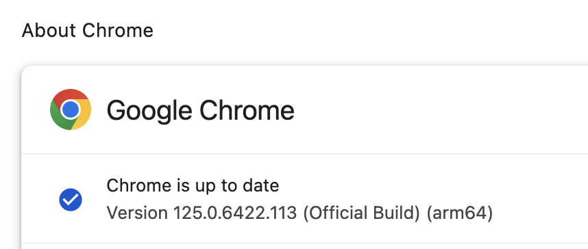

## Dependencies

- Install [Python3](https://www.python.org/downloads/)

- Install Selenium

  ```bash
  pip3 install selenium
  ```

- Install Google Chrome

- Download [Chrome for testing](https://googlechromelabs.github.io/chrome-for-testing/#stable)

> [!NOTE]
> Check your chrome version on Settings >> About Chrome




## Execute

Run the script in the CLI. It will loop continuously every 10min.

```py
python3 scrape.py
```
